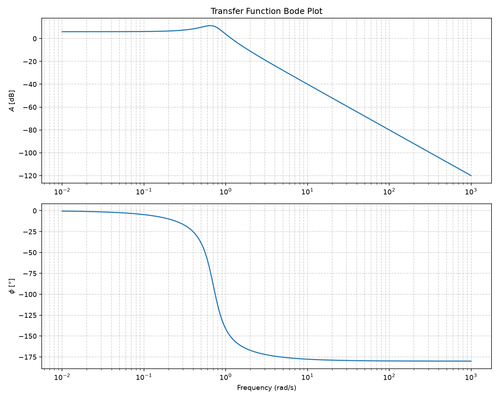

# Control System Analysis in Python

An interactive student tool by Matej Grajžl for exploring continuous-time, single-input single-output transfer functions. The command-line prompts are in Slovenian and the plot labels are in English.

## Features

- Bode magnitude and phase diagrams
- Step and impulse responses
- Pole–zero map and numerical poles, zeros and gain
- Root locus using python-control
- Reuse a transfer function or enter another one

## Setup and run

Use Python 3.10 or later. From this folder:

```sh
python -m venv .venv
# Windows:
.venv\Scripts\activate
# macOS/Linux instead: source .venv/bin/activate
python -m pip install -r requirements.txt
python control_analysis.py
```

A desktop plotting environment is needed for interactive windows. Enter coefficients in descending powers of s, separated by spaces. For `G(s) = 1 / (s² + 0.4s + 0.5)`, enter `1` for the numerator and `1 0.4 0.5` for the denominator. Select 1–5; close the plot to return to the terminal. `da` means yes and `ne` means no. Select 6 to exit.

## Limits

Time plots use 0–100 s and Bode plots use 0.01–1000 rad/s; adjust these ranges for very fast or slow systems. Coefficients must be finite with nonzero leading terms. This educational tool restricts time-response plots to strictly proper transfer functions, avoiding direct impulses. It does not implement discrete-time systems, delays or robust analysis. Unstable systems may produce very large responses.

## Learning focus

Polynomial representation, transfer functions, time/frequency response, poles and zeros, and introductory feedback analysis. The original plotting functions are retained, with small input-handling and polynomial-formatting fixes and an import-safe entry point.

[Root locus API documentation](https://python-control.readthedocs.io/en/stable/generated/control.root_locus_plot.html).

## Example plot

Generated by this program for `1 / (s² + 0.4s + 0.5)`:



## Verification

Tested with Python 3.12, NumPy 2.5.3, SciPy 1.18.1, Matplotlib 3.11.2 and python-control 0.10.2. All five plotting functions were exercised with a non-interactive backend, along with invalid menu input, coefficient validation and polynomial formatting. Interactive desktop window behavior still needs a local check.
